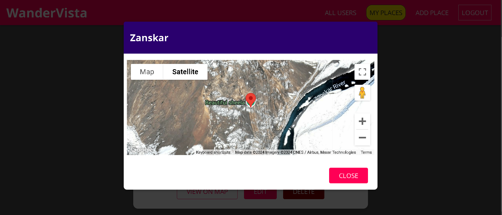

# WanderVista - Destination Sharing App

WanderVista is a full-stack MERN (MongoDB, Express, React, Node.js) application that allows users to share their favorite destinations by uploading images, descriptions, and addresses. Users can create, edit, or delete their posts and view shared locations on an interactive map powered by the Google Maps API. 

## Features

- **User Authentication & Authorization**: Secure user registration and login using JWT tokens.
- **Destination Sharing**: Users can add new places with a name, description, image, and address.
- **Image Upload**: Supports image uploads for the destinations.
- **Interactive Map**: Displays locations on a map using the Google Maps API.
- **CRUD Operations**: Users can create, read, update, and delete their shared destinations.
- **Responsive Design**: The app is responsive and works seamlessly across different devices.
- **Deployment**: Frontend deployed on Firebase and backend hosted on Render.

## Technologies Used

- **Frontend**: React, React Router, Firebase Hosting
- **Backend**: Node.js, Express.js, MongoDB (Mongoose), JWT
- **APIs**: Google Maps API
- **Deployment**: Firebase (Frontend), Render (Backend)
- **Others**: Multer (for file uploads), Axios (for HTTP requests)

### Usage
- Register or Login to access the app.
- Add a New Place: Fill in the form with a title, description, image, and address. The app will use the Google Maps API to display the location.
- Edit or Delete your places using the options available on each post.

## Installation

To run WanderVista locally, follow these steps:

### Prerequisites

- Node.js and npm installed
- MongoDB running locally or a MongoDB Atlas cluster

### Clone the Repository

```bash
git clone https://github.com/yourusername/WanderVista-Destination-Sharing-App.git
cd WanderVista-Destination-Sharing-App
```

### Homepage


### Add New Place


### Map View

